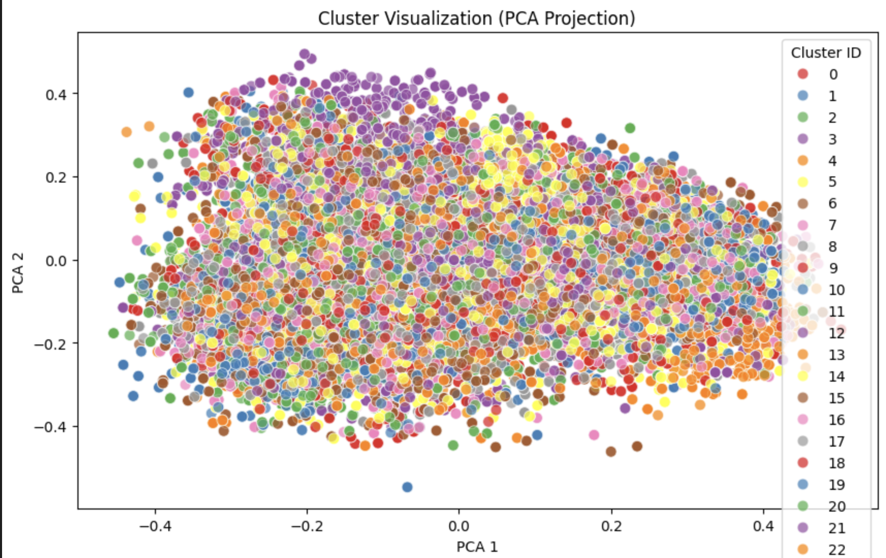

## Product Deduplication Pipeline


## Overview

This project aims to deduplicate a product dataset by identifying and merging duplicate entries based on certain key attributes. We leverage DBSCAN clustering to identify duplicate records, and then merge them based on specific fields (e.g., product descriptions).

### Outcome:

After applying the deduplication process, we achieved the following results:


The process is split into several steps:

1. **Initial Filtering of Duplicates**
2. **Clustering with DBSCAN**
3. **Merging Duplicates Based on Description**
4. **Final Deduplication and Comparison**

### Libraries Used

- **Pandas**: Data manipulation and analysis.
- **Scikit-learn**: For DBSCAN clustering.
- **Sentence-Transformers**: For generating text embeddings to help with clustering.

## Steps

### 1. Initial Filtering of Duplicates

We start by filtering potential duplicates in the dataset based on `product_name`, `product_title`, and `industry_simplified`. This is done to identify entries that could be duplicates before further processing.

#### Example

Given a dataset of products, we first identify products with identical names, titles, or industries as potential duplicates. 

### 2.1. Clustering with DBSCAN

Next, we apply DBSCAN clustering to group similar products based on the generated embeddings from the `product_name`, `product_title`, `brand`, and `industry_simplified` (we make clustering based on a match sentence build the following:).

### `create_match_sentence` Function - Example

The `create_match_sentence` function creates a text sentence from selected columns of a product to help identify and match similar products. Here's a practical example showing how it works:


#### Example Data:

| product_name    | product_title           | brand         | industry_simplified       |
|-----------------|-------------------------|---------------|---------------------------|
| Ball 3D         | 3D Ball Tool            | BallTech      | ['Sports', 'Toys']        |
| Football        | Official Football Ball  | Sporty Goods  | ['Sports']                |


#### Output:

| product_name    | product_title           | brand         | industry_simplified       | match_sentence                                      |
|-----------------|-------------------------|---------------|---------------------------|-----------------------------------------------------|
| Ball 3D         | 3D Ball Tool            | BallTech      | ['Sports', 'Toys']        | Ball 3D 3D Ball Tool BallTech ['Sports', 'Toys']   |
| Football        | Official Football Ball  | Sporty Goods  | ['Sports']                | Football Official Football Ball Sporty Goods ['Sports'] |

#### Explanation:

- The `create_match_sentence` function concatenates the `product_name`, `product_title`, `brand`, and `industry_simplified` columns to form a sentence for each product.
- For the first row, the match sentence is:
  ```
  "Ball 3D 3D Ball Tool BallTech ['Sports', 'Toys']"
  ```
- For the second row, the match sentence is:
  ```
  "Football Official Football Ball Sporty Goods ['Sports']"
  ```

These sentences can now be used for comparing products, identifying similar products, or applying clustering algorithms.


### 2.2. Inspection of Clusters

Once clusters are created using DBSCAN, it’s important to inspect the results and verify the products in each cluster. The `inspect_cluster()` function allows you to view the relevant product details for a given cluster.


#### Example

You can inspect a specific cluster by providing the `cluster_id_to_inspect` and it will return the relevant details (like product name, title, description, etc.) for that cluster. You can also save the results to a CSV for further inspection.

### 2.3. Distribution of the Clusters

This section visualizes the distribution of clusters after applying PCA for dimensionality reduction. The clusters are plotted based on their PCA components, showing how they are grouped in a 2D space. The plot helps to understand the spread and density of different clusters within the dataset.



### 3. Merging Duplicates Based on Product Information

Once duplicates are identified, the next step is to merge them into a single, enriched entry. This process ensures that only the most complete and accurate information is retained for each product while eliminating redundancy.

### Example of Merging Duplicates

In the following table, we illustrate how duplicates in a product cluster are merged into a single, enriched record based on the product attributes:

| **Field**         | **Entry 1**                               | **Entry 2**                               | **Merged Result**                          |
|-------------------|-------------------------------------------|-------------------------------------------|--------------------------------------------|
| **product_name**  | "Ball 3D"                                 | "Ball 3D Tool"                           | "Ball 3D"                                  |
| **product_title** | "3D Ball"                                 | "Ball 3D Tool for Sports"                | "3D Ball"                                  |
| **brand**         | "BrandA"                                  | "BrandB"                                  | "BrandA | BrandB"                          |
| **description**   | "A 3D printed ball used in various games."| "A ball designed for sports and activities."| "A 3D printed ball used in various games. A ball designed for sports and activities." |
| **industry_simplified** | "Sports"                            | "Sports"                                  | "Sports"                                   |
| **price**         | {"amount": 24.0, "currency": "USD"}       | {"amount": 22.0, "currency": "USD"}       | 23.0 (average of 24.0 and 22.0)            |

### Explanation:

- **`product_name` and `product_title`**: Both entries have a similar name, so the first non-null value is used in the merged result.
- **`brand`**: Multiple brands ("BrandA" and "BrandB") are concatenated using the delimiter " | " to reflect all associated brands.
- **`description`**: The descriptions are combined into a single entry by concatenating them.
- **`industry_simplified`**: The industry remains the same, as both entries belong to the "Sports" category.
- **`price`**: The average of the available prices is calculated, yielding a final price of 23.0 USD.

This table helps visualize how the merging process works and ensures that no important information is lost while eliminating duplicate entries.

### 4. Comparison

After merging the duplicates, we combine the deduplicated clusters with the non-duplicates, ensuring that all records are unique and enriched. The final dataset is then saved as a `.parquet` file.


#### Example

After merging, the deduplicated clusters are combined with non-duplicates and saved back to a new `.parquet` file.

### Room for Improvement

1. **Field-Specific Merging Functions**
   Currently, all fields are merged into one consolidated record per cluster. However, we can further improve this process by implementing specific functions to efficiently merge each column. This would provide more control over how different types of data are merged, enabling us to optimize the merging strategy for each field (e.g., handling numeric fields, categorical fields, or text fields differently).

2. **Clustering the Clusters**
   After performing the initial clustering, we could perform another round of clustering on the already deduplicated clusters. This secondary clustering could help ensure that the data remains unique and free from overlapping duplicates that might have been missed initially. By re-clustering the clusters, we can ensure that even fine-grained duplicates are detected and handled properly.

3. **Scalability**
   The current implementation may struggle to scale efficiently with larger datasets, especially when dealing with billions of records. To handle larger datasets more efficiently, optimizations such as parallel processing (e.g., using Dask or Spark for distributed computation) or more scalable clustering methods (e.g., HDBSCAN) may be required.

4. **Advanced Deduplication Strategies**
   To improve the accuracy of deduplication, we could explore more advanced strategies, such as fuzzy matching for fields like `product_name` and `product_title`, or applying machine learning models that can predict duplicates more effectively. By leveraging NLP techniques and pre-trained models, we could potentially improve the clustering accuracy and reduce the risk of false positives or false negatives.

5. **Handling Noisy Data**
   A more sophisticated noise-handling mechanism can be implemented to handle data that doesn't fit well within clusters. This could include applying additional filtering or classification steps to distinguish between genuine outliers and noise, ensuring the final dataset is of higher quality.


